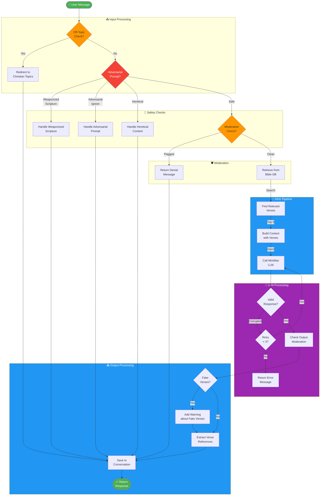
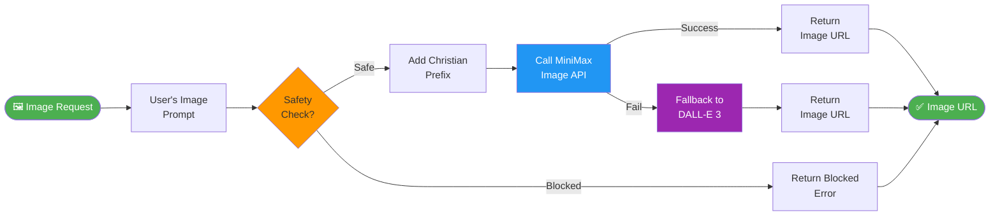

# Approach Diagram - Chat Processing Flow



---

## Step-by-Step Flow

### 1. Input Reception
```
User sends message → API receives → Check if off-topic
```

### 2. Safety Checks (Early Exit)
```
Off-topic? → Redirect (exit)
Adversarial prompt? → Deny (exit)
Heretical content? → Deny (exit)
Moderation flagged? → Deny (exit)
```

### 3. RAG Pipeline
```
Retrieve → Keyword search Bible DB → Get top 5 verses
                                      ↓
Build context → Inject verses into prompt
                                      ↓
Call MiniMax LLM → Get response
```

### 4. Validation & Retry
```
Response valid? → No → Retry (max 3 attempts)
Response valid? → Yes → Continue
```

### 5. Output Processing
```
Output moderation check
       ↓
Fake verse detection
       ↓
Extract verse references
       ↓
Save to conversation history
       ↓
Return response
```

---

## Image Generation Flow


