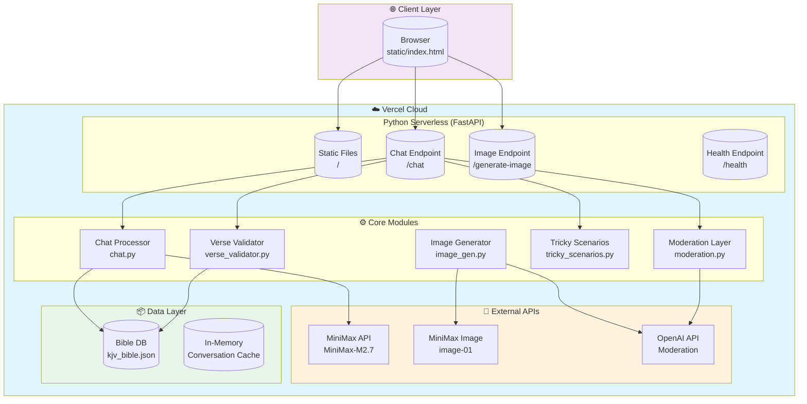

# Architecture Diagram

---

## Component Details

### Client Layer
- **Browser**: Loads static HTML/JS chat interface
- **No build step**: Pure static files served directly

### API Layer (Serverless)
- **FastAPI**: Handles HTTP requests
- **Endpoints**: `/`, `/chat`, `/generate-image`, `/health`
- **Error handling**: Graceful 500 responses with details

### Core Modules

| Module | Purpose |
|--------|---------|
| `chat.py` | Main RAG pipeline - orchestrates all processing |
| `moderation.py` | Input/output content filtering |
| `tricky_scenarios.py` | Adversarial prompt detection |
| `verse_validator.py` | Fake verse detection |
| `image_gen.py` | Image generation with safety checks |
| `bible_db.py` | Bible verse lookup & search |
| `minimax_client.py` | MiniMax API client |

### External Services

| Service | Usage |
|---------|-------|
| MiniMax API | LLM chat completions |
| MiniMax Image | Image generation |
| OpenAI API | Content moderation |

### Data Storage

| Store | Type | Purpose |
|-------|------|---------|
| `kjv_bible.json` | JSON file | 31K Bible verses |
| In-memory dict | RAM | Conversation history |
