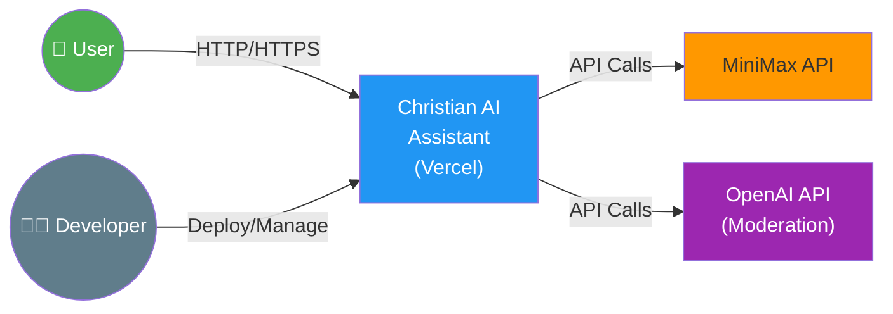
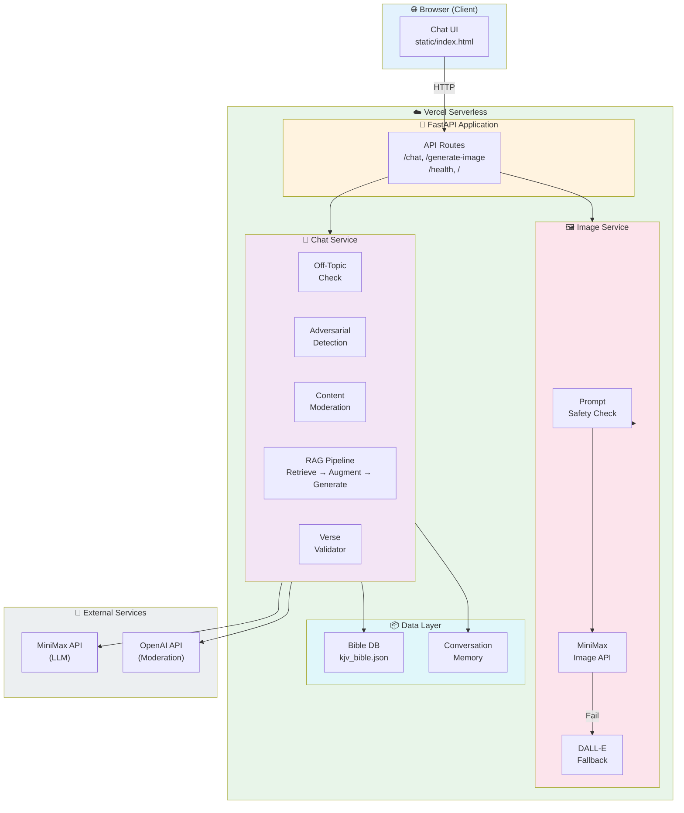

# Architecture Diagram - C1 & C2 Views

---

## C1: Context Diagram



### C1 Description

| Component | Type | Description |
|-----------|------|-------------|
| User | External Actor | End user accessing via browser |
| Christian AI Assistant | System | The deployed application on Vercel |
| MiniMax API | External System | LLM chat & image generation |
| OpenAI API | External System | Content moderation |
| Developer | External Actor | Deploys and manages the system |

---

## C2: Container Diagram



### C2 Components

| Container | Responsibility | Technologies |
|-----------|----------------|--------------|
| Chat UI | User interface for messaging | HTML, CSS, JavaScript |
| API Routes | HTTP request handling | FastAPI |
| Off-Topic Check | Filter non-Christian questions | Python |
| Adversarial Detection | Block jailbreak attempts | Python regex + keywords |
| Content Moderation | Filter harmful content | OpenAI API + keywords |
| RAG Pipeline | Scripture-grounded responses | Keyword search + MiniMax |
| Verse Validator | Detect fake/hallucinated verses | Python |
| Image Service | Generate Christian images | MiniMax + DALL-E |
| Bible DB | Store 31K KJV verses | JSON file |
| Memory | Conversation history | In-memory dict |

---

## Data Flow Summary

```
User Input → Off-Topic Check → Adversarial Check → Moderation
                                                        ↓
                                                    RAG Pipeline
                                                    ↓
Bible DB ← Retrieve ← Prompt + Context → MiniMax LLM
                                                    ↓
                                          Validate Response
                                                    ↓
                                          Fake Verse Check
                                                    ↓
                                          Return + Citations
```
